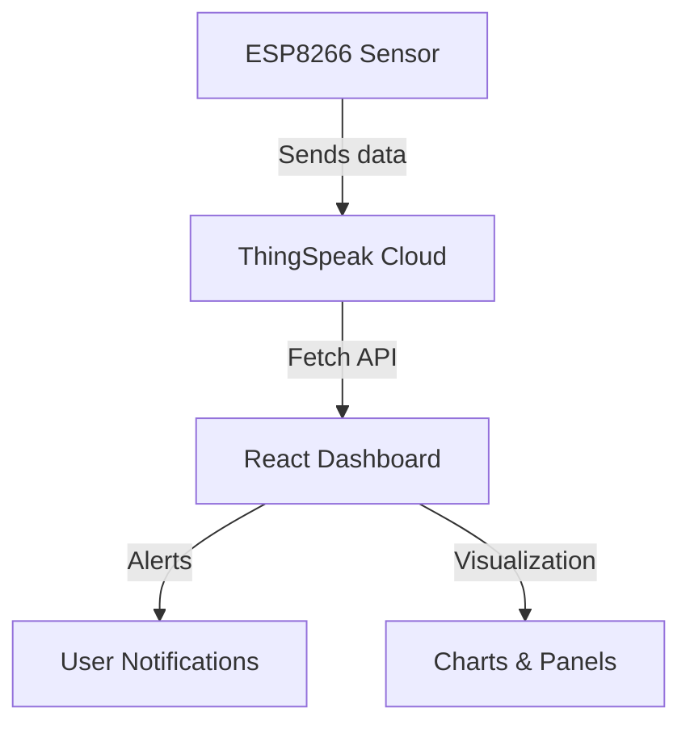

# 💧 Water Level Monitor App

  

---

## 🌊 Project Overview

> This project is my **Final Year Project (FYP)** focused on solving the challenge of **real-time water level monitoring** using **IoT technology**.  
> It helps prevent water overflow, manage water resources efficiently, and send alerts when the water level is low.

📌 **Purpose:**

- Track water levels & pump status remotely
- Receive **critical alerts** for low water or battery
- Responsive, user-friendly **dashboard**
- Monitor ESP8266 **connectivity in real-time**

---

## ⚡ Features

<div style="display:flex; gap:10px; flex-wrap:wrap;">
  <span>🌊 Real-time water monitoring ✅</span>
  <span>🚨 Alerts for critical levels ✅</span>
  <span>📱💻 Responsive dashboard ✅</span>
  <span>🔒 User authentication ✅</span>
  <span>📡🔋 Connectivity & battery monitoring ✅</span>
</div>

> **Alert Logic**:

- `Water level < 20%` → Critical 🚨
- `Water level < 40%` → Warning ⚠️
- `Pump OFF & level < 60%` → Warning ⚠️
- `Sensor disconnected` → Danger ❌

---

## 🏗 System Architecture



**Components:**

- **ESP8266:** Measures water level, pump status, battery
- **ThingSpeak:** Cloud storage for sensor data
- **React App:** Dashboard & alerts
- **Notifications:** Browser push alerts for critical events

---

## 🔄 How It Works

1️⃣ **Sensor Measurement:** ESP8266 sends water level & pump data to ThingSpeak
2️⃣ **Data Fetching:** React app polls ThingSpeak API periodically
3️⃣ **Dashboard Display:**

- Live water level visualization 🌊
- Pump status indicator ⚙️
- Battery & connectivity indicators 🔋📡
  4️⃣ **Alerts Triggered** for critical events 🚨

---

## 🛠 Installation & Setup

```bash
# Clone repo
git clone https://github.com/Ogidol/water-level-monitor.git
cd water-level-monitor

# Install dependencies
npm install

# Set up ThingSpeak API key
REACT_APP_THINGSPEAK_API_KEY=YOUR_API_KEY

# Run app
npm start
```

---

## 👀 Usage

- Open dashboard on desktop or mobile 🖥️📱
- Login with credentials 🔑
- Monitor **water levels**, **pump status**, and **battery**
- Manual **Refresh** available 🔄
- Alerts appear for **critical events** 🚨

---

## 🖼 Screenshots

| Desktop Dashboard                 | Mobile View                   |
| --------------------------------- | ----------------------------- |
|  |  |

---

## 🧰 Technologies

<div style="display:flex; gap:15px; flex-wrap:wrap;">
  <span>⚛️ React</span>
  <span>🌐 Tailwind CSS</span>
  <span>💻 TypeScript</span>
  <span>📡 ESP8266</span>
  <span>☁️ ThingSpeak</span>
  <span>📊 Chart.js</span>
</div>

---

## 👤 Contributors

- **Idris Ogundele Olawale** – Frontend, IoT, dashboard design
- Optional team members

---

## 📌 Future Enhancements

- Historical water level analytics 📊
- Mobile push notifications 📱
- Multi-tank monitoring 🏞
- Automatic pump control ⚙️

---

## 🎨 Infographic Preview

```markdown

```
